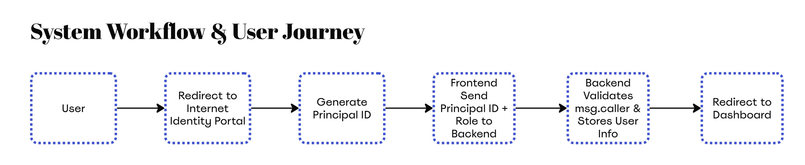

## Medical Chain ID: Patient - Centered Healthcare on Blockchain
We're building for a future where your health data belongs to you

## Overview
Medical Chain ID is a blockchain-based platform built on the Internet Computer Protocol (ICP) to solve healthcare data fragmentation. The platform gives patients full control of their medical records, enabling secure, encrypted, and permission-based data sharing with healthcare providers across institutions.

With Internet Identity authentication and advanced encryption, patients can manage their complete health history diagnoses, prescriptions, lab results, and vaccinations in one place. Real-time access control allows patients to decide who can view their data and for how long.

Designed for interoperability and future healthcare needs, Medical Chain ID creates a decentralized, transparent, and patient-owned health data ecosystem that improves medical outcomes and strengthens trust between patients and providers.

## Value Proposition
- Unique Use Case: Patient-centric medical data ownership using decentralized Web3 technologies.
- Real-World Impact: Reduces diagnostic errors and delays through unified, controlled access to records.
- Monetization Potential: Future revenue through B2B SaaS model for healthcare institutions and premium identity integrations.

## Core Features
For Patients
- Full Data Ownership: Patients control their entire medical history, stored securely on blockchain.
- Zero Data Loss: All records encrypted and permanently available, immune to tampering or deletion.
- Granular Access Control: Decide which doctor can access what data, and for how long.
- Internet Identity Login: Passwordless authentication with biometrics and device-based identity.
- Unified Health Record: Consolidates prescriptions, lab results, imaging, vaccination, and medical history into one place.
- Emergency Mode: Temporary access for emergency doctors when patients cannot give consent manually.

For Doctors & Hospitals
- Instant Data Access: With patient approval, doctors get accurate, real-time medical history.
- Interoperability Tools: Easy integration with existing hospital systems (EHR/EMR) via APIs.
- Lower Operational Costs: No need for expensive custom data storage—use secure blockchain infrastructure.
- Audit Trail: Transparent log of all data access, ensuring trust and accountability.
- Research Access (with patient consent): Anonymized datasets for clinical research and trials.
- Future-Proof Architecture: Ready for telemedicine, AI diagnostics, and global interoperability.


## Technical Architecture
### Frontend – User Interface (React + TailwindCSS)

Language: JavaScript (React) + TailwindCSS

Key Components:
App.jsx
- Root component managing page routing and layout structure
main.jsx
- Application root file, responsible for rendering App.jsx
index.css & tailwind.config.js
- TailwindCSS styling
- Responsive and modern UI design

Frontend Responsibilities:
- Interact with the backend canister using JavaScript bindings
- Provide smooth UX for login, viewing, creating, and managing access to records

Configuration & Integration
dfx.json
- Canister configuration for Internet Computer (defines canisters, language, etc.)
package.json
- Dependency management for React frontend and TailwindCSS


### Backend – Smart Contract (Motoko)

Language: Motoko

Key Components:
main.mo – Core Smart Contract:
- Stores all data in a StableBTreeMap (persistence across upgrades/restarts)
- Handles access authorization using Internet Computer’s Principal ID
- Exposes interface to frontend via .did (Candid interface)

Core Responsibilities:
- Secure storage and retrieval of patient medical records
- CRUD operations for medical data
- Access control system based on Principal ID (Internet Identity)

## System Workflow and User Journey


## Getting Started
Before you begin, ensure you have the following installed on your system:
1. Node.js and npm Installation

First, install Node.js which includes npm package manager:
- Visit [Node.js official website](https://nodejs.org/en) and download the LTS version
- Verify installation:
```bash
node --version
npm --version
```
2. DFX (Internet Computer SDK) Setup

We will be using Dfinity's dfx for our development environment.
1.	Install DFX: Follow the instructions on [Dfinity's SDK documentation.](https://internetcomputer.org/docs/building-apps/getting-started/install)
2.	Verify DFX installation:
```bash
dfx --version
```

## Project Setup
1. Clone the Repository
```bash
git clone <your-repository-url>
cd medical-chain-id
```
2. Install Dependencies
Install all necessary Node.js packages for the frontend:
```bash
npm install
```
3. Start DFX Local Network
Start the DFX replica in the background:
```bash
dfx start --background
```
4. Deploy Canisters
Deploy all canisters and generate the Candid interface:
```bash
dfx deploy
```
5. Generate Candid Interface
If you make changes to the backend, regenerate the Candid interface:
```bash
npm run generate
```
6. Start Development Server
Launch the frontend development server:
```bash
npm start
```

## Troubleshooting
DFX not starting:
```bash
dfx stop
dfx start --clean --background
```
Canister deployment fails:
```bash
dfx canister delete --all
dfx deploy
```
Frontend build errors:
```bash
npm run generate
npm start
```

## Medical Chain ID Roadmap

### Phase 1 – Core Infrastructure
- Deploy secure Motoko backend with blockchain-based medical record storage that ensures immutable and tamper-proof patient data.
- Integrate Internet Identity for passwordless authentication that eliminates the need for traditional login credentials.
- Launch a comprehensive patient dashboard built with React that enables users to securely manage, view, and share their complete personal medical records through an intuitive web interface.
- Enable encrypted record sharing with selected healthcare providers.
- Develop a comprehensive audit trail system for transparent data access logs that tracks every interaction with medical records.

### Phase 2 – Interoperability & Expansion
- Integrate seamlessly with hospital systems through EHR and EMR interoperability via robust APIs.
- Add support for multiple health data types including imaging, lab results, prescriptions, and vaccination history.
- Launch mobile app for Android and iOS platforms enabling patient access and secure record sharing on-the-go.
- Expand granular permission system for real-time access control with emergency sharing mode for critical situations.

### Phase 3 – AI & Advanced Health Services
- Implement AI-powered analytics for preventive care that delivers risk alerts and chronic disease tracking capabilities.
- Enable secure doctor-to-doctor record transfer across different institutions with zero data loss.
- Introduce telemedicine integration featuring secure video consults with direct record sharing functionality.
- Launch decentralized health identity Medical Chain ID Passport for seamless cross-border healthcare access.

### Phase 4 – Decentralized Governance & Global Ecosystem
- Transition to DAO-based governance for protocol upgrades and ecosystem policies managed by community consensus.
- Launch tokenized incentives for hospitals and patients who contribute by sharing anonymized data for medical research.
- Develop comprehensive SDK and API for third-party health apps and research institutions to build upon the platform.
- Expand globally with cross-country healthcare interoperability and full compliance with international standards including HIPAA, GDPR, and Indonesia's PDP Law.

## Renenue Model - Phase 1
### For Patients
- Freemium Access: Free storage for essential health records including basic visits, prescriptions, and vaccination history.
- Subscription Plans: Paid tier ranging from $3 to $7 per month for expanded storage capacity and premium features like AI health assistant with medication reminders.
- Emergency Mode: Included in premium plans to provide doctors instant temporary access during critical medical emergencies.

### For Doctors
- Free Basic Access: Doctors can securely view patient data with proper consent at no cost to encourage widespread adoption.
- Premium Tools: Optional subscription for advanced features including patient analytics dashboards, bulk record management, and seamless clinic system integration.
- Future Upsell: Scalable EMR and EHR integration services for seamless workflow optimization as adoption increases across healthcare providers.

## Developers
1.	Benedito Nidio Da Rosa Maia Tilman – Full-Stack Developer
2.	Renald Kevin Azzaky – UI/UX Designer
3.	I Made Dedy Wanditya – Full-Stack Developer
4.	Aditya Putra Ferdiansyah – Full-Stack Developer
5.	Ni Luh Risma Putri Wirdianthi – Technical Writer
